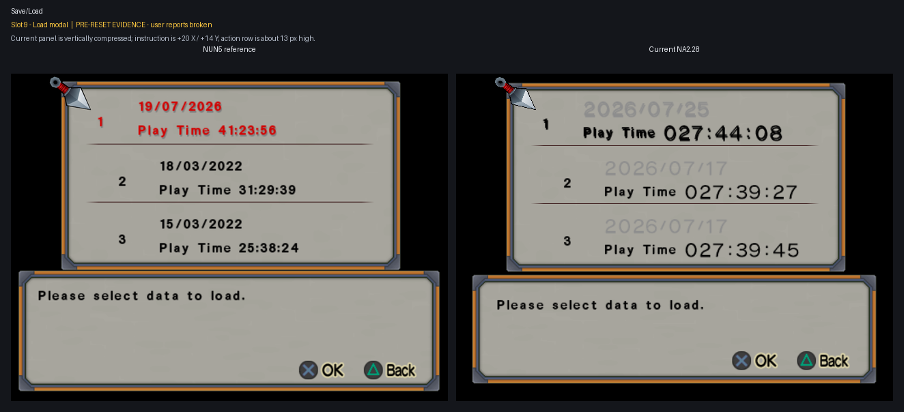

# Autofit and positions reimplementation

This epic rebuilds text fitting and positioning with the user one accepted
stage at a time. It uses the accepted native NUN5-derived font as the fixed
raster/metric baseline and reuses the preserved disassembly, runtime findings,
and negative results without treating the rejected integrated layout stack as
approved behavior.

## Execution contract

- Sequential mode is active. Each stage is implemented, committed, pushed,
  and reported before the next stage begins.
- `font_nun5_glyphs` remains enabled. The accepted font itself is not part of
  this reset.
- The generic resident patcher, Font fragments, relocations, assets, hooks,
  and declarative rows remain present for research and selective reuse.
- The resident engine retains and validates default-disabled rows. With all
  Font resident rows off, it contributes no Font fragments or hooks to the
  composed payload.
- The July 24-25 autofit/layout stack is retained but default-disabled:
  `font_renderer_metrics` and `font_controls_auto_fit` in both the binary and
  resident modules, plus resident `font_layout_wrappers`.
- `font_modal_alignment` remains enabled. It is the separately reviewed
  Character Select `Back to Game Mode Screen` row alignment and is not the
  Save/Load lower modal recorded in slot 9.
- Shared behavior should be implemented once when caller evidence proves a
  common wrapper or denominator. Container-specific bounds and offsets remain
  separate when the games do.

## Stage 0 - reset baseline

The first stage disables every retained autofit/layout component from the
rejected integrated stack without deleting its implementation:

| Module | Patch | Default after reset |
| --- | --- | --- |
| `binary_patcher` | `font_renderer_metrics` | disabled |
| `binary_patcher` | `font_controls_auto_fit` | disabled |
| `resident_patcher` | `font_renderer_metrics` | disabled |
| `resident_patcher` | `font_controls_auto_fit` | disabled |
| `resident_patcher` | `font_layout_wrappers` | disabled |

The post-reset runtime baseline still needs a fresh capture before any one of
these components can be reintroduced.

No separate unfinished Practice command-explanation patch is present in the
live canonical package, so there was no additional executable row to disable.
Its retained task-owned screenshots and analysis remain available for its
later stage.

## Save/Load

### Slot 9 - current broken lower modal

The user identified `ss9` as the current state of the Save/Load modal that was
broken previously. The protected state was copied read-only from
`@pcsx2_user/sstates/SLOP-NA228 (D61F4C01).09.p2s` to
`work/Font/inputs/sstates/autofit_positions/modal/na2/` with SHA-256
`5EE0E06A4B31EDD2F81F77A10B447C504620864DD1D5D9A8D410A940B65E1335`.
Its embedded screenshot has SHA-256
`BAED2975F367ABF0D0C36272159FA94E64F794BD2492B37E109CE232F64BFCD4`.

No new matching NUN5 slot-9 state was supplied. The comparison therefore uses
the retained matched 640x480 NUN5 Save/Load reference capture, copied to the
same task-owned input group with SHA-256
`55626DB58BB0316F2502A20B2B825AABD25C94D343A427242F15C12A3343B2DC`.
Full provenance is retained in
`work/Font/inputs/sstates/autofit_positions/modal/provenance.json`.

Measured at 640x480:

- NUN5 lower-panel orange borders occupy `y=289..293` and `y=460..464`;
  current NA2 occupies `y=296..299` and `y=449..452`.
- NUN5 instruction ink bounds are `(41,318)-(341,331)`; current NA2 bounds
  are `(61,332)-(361,345)`, beginning 20 pixels farther right and 14 pixels
  lower.
- NUN5 action-row ink bounds are `(422,421)-(590,444)`; current NA2 bounds are
  `(405,407)-(572,433)`, placing the current row about 13 pixels higher.

The current lower panel is therefore shorter and vertically compressed, while
its two text regions move in opposite vertical directions. This is recorded as
a user-reported broken baseline. Causation is deliberately unassigned until a
post-reset capture is made: retained earlier NA2 evidence shows the same panel
geometry, so the newest wrapper stack is not yet proven to be its origin.

## Remaining evidence inventory

The retained matched comparison library covers these cases:

1. Practice pause list.
2. Control Settings.
3. Command Chart.
4. Practice command explanation.
5. Practice settings.
6. Practice quit confirmation.
7. Character Select return confirmation.
8. Collection quit confirmation.
9. Collection movie list.
10. No-memory-card prompt.
11. Save/Load lower modal (`ss9`, current-only state plus retained NUN5
    reference capture).

This is an evidence inventory, not an assumption that each screen needs a
separate patch. After the reset baseline is accepted, each implementation
stage will select one proven caller family and will regression-check every
inventory case that shares it.
