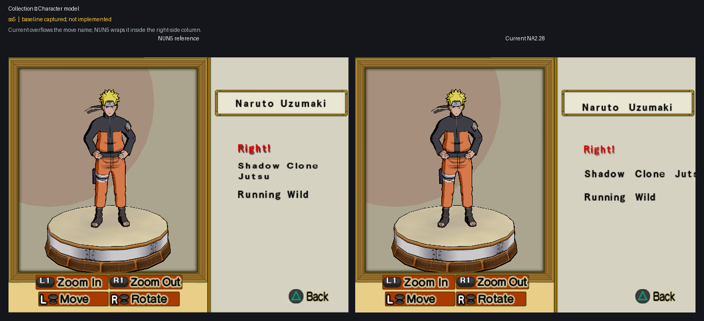
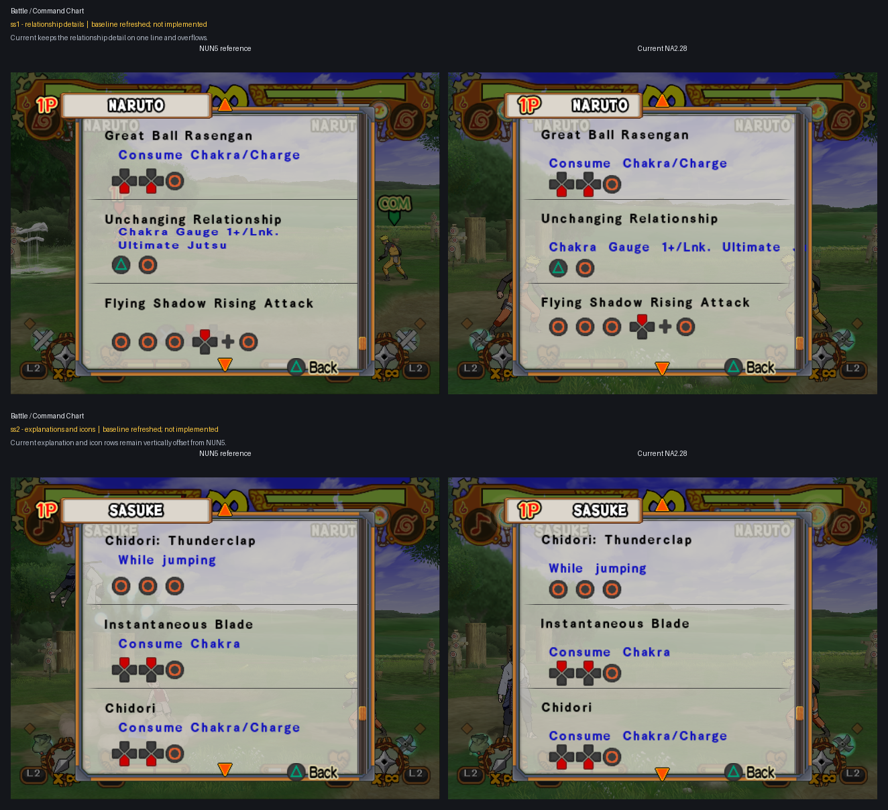
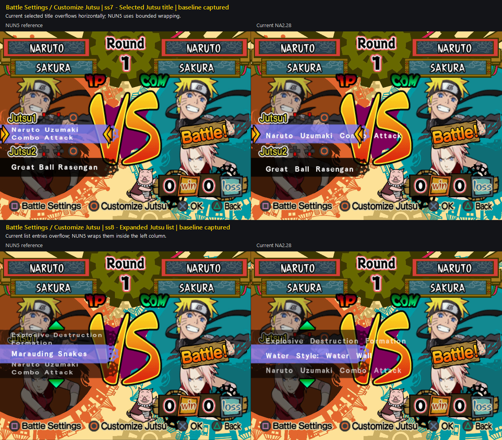

# Layout parity batches

User-declared Font epic covering matched NUN5/NA2.28 layout cases. Slots 2–6
formed the original declaration; the user later added and accepted the remade
Special Controls slot 1 pair. On 2026-07-27 the user added a distinct new
matched batch in slots 1–10, then supplied one additional Command Chart ss1
pair. The epic runs in efficiency-prioritized sequential mode: implement one
case or proven shared caller family, commit and push it, present its
NUN5-left/Current-NA2-right result, then wait for explicit user acceptance
before beginning the next case.

## Scope and evidence

- Declared: 2026-07-27.
- Inputs:
  `work/Font/inputs/sstates/epics/ss2-6/` and
  `work/Font/inputs/sstates/batches/2026-07-27-ss1-10/`, plus
  `work/Font/inputs/sstates/batches/2026-07-27-additional-ss1/` and
  `work/Font/inputs/sstates/batches/2026-07-29-priority4-ss1/`.
- Extracted source screenshots:
  `work/Font/inputs/screenshots/epics/ss2-6/` and
  `work/Font/inputs/screenshots/batches/2026-07-27-ss1-10/`, plus
  `work/Font/inputs/screenshots/batches/2026-07-27-additional-ss1/` and
  `work/Font/inputs/screenshots/batches/2026-07-29-priority4-ss1/`.
- Provenance:
  `work/Font/inputs/sstates/epics/ss2-6/provenance.tsv` and
  `work/Font/inputs/sstates/batches/2026-07-27-ss1-10/provenance.tsv`, plus
  `work/Font/inputs/sstates/batches/2026-07-27-additional-ss1/provenance.tsv`
  and
  `work/Font/inputs/sstates/batches/2026-07-29-priority4-ss1/provenance.tsv`.
- Protected `@pcsx2_user` sources remain untouched.
- Status: the remade ss2 and ss3 pair records the same Pause Controls modal in
  normal and selected states. Both are user-verified and removed from the
  remaining report. The shared quit-confirmation and ss1 Special Controls cases
  are also user-verified and removed. The original batch retains two cases and
  the new batch contributes ten baseline cases. The additional Command Chart
  ss1 raises the remaining total to thirteen cases. The 2026-07-29 remade ss1
  supersedes the old ss10 Mode Select evidence without changing that total.
- Existing accepted Font and resident-renderer behavior remains the regression
  baseline. The previously retained Command Chart ss2 image was superseded by
  the remade Pause Controls ss2 state and is no longer an epic input.
- Text-content differences are normally routed to the translation workstreams.

## Collection

### Priority 6 — Original ss5: Character model move list

- State: baseline captured; not implemented.
- Remaining defect: Current overflows the long move name, while NUN5 wraps it
  inside the right-side column.

### Priority 7 — Original ss6: Movie list

- State: baseline captured; not implemented.
- Remaining defect: Current movie titles remain single-line and overflow,
  while NUN5 uses variable-height wrapped rows.

### Priority 4 — New batch ss1: Quit Collection confirmation

- State: baseline captured; not implemented.
- Review target: shared modal selector and body geometry.

## Battle / Practice Settings

### Priority 5 — New batch ss2–ss3: Settings rows and explanations

- State: two matched baselines captured; not implemented.
- Review targets: row-value geometry, selection alignment, and lower
  explanatory-text flow. Content differences remain translation-owned.

## Battle / Command Chart

### Priority 1 — New batch ss4 and additional ss1: Command details

- State: two matched baselines captured; not implemented.
- ss4: Current keeps the relationship explanation on one line and overflows;
  NUN5 wraps it within the command-details panel.
- Additional ss1: Current's blue explanation and controller-icon rows sit
  roughly 8–14 pixels lower than NUN5 within each command entry.

## Character Select

### Priority 3 — New batch ss5, ss6, and ss9: Shared selection/modal family

- State: three matched baselines captured; not implemented.
- ss5: Current's final `Back to Game Mode Screen` option overflows the modal.
- ss6: Linked Mode is retained as a regression case for shared selector
  geometry.
- ss9: Current's return-confirmation body overflows while NUN5 fits it inside
  the footer box.

## Battle Settings / Customize Jutsu

### Priority 2 — New batch ss7–ss8: Jutsu-name list

- State: two matched baselines captured; not implemented.
- Remaining defect: Current selected and expanded-list titles overflow
  horizontally; NUN5 wraps them inside the left-side list bounds.

## Mode Select

### Priority 4 — Remade ss1: Return to Title Screen confirmation

- State: exact-guarded candidate captured; implementation is ready for the
  user's normal-build regression. This pair supersedes the prior new-batch
  ss10 evidence.
- Result: the body remains unchanged; the existing C-owned Yes/No mapper now
  centers both labels and reproduces NUN5 row spacing through one isolated
  Mode Select caller hook.

## Current priorities

Priority is determined by the most efficient implementation order. Priority 4
is one shared confirmation-regression subtask represented by separate
Collection and Mode Select grids so each remains under its semantic section.

1. **New ss4 plus additional ss1 — Command Chart details.** Reuse the
   established command/practice text-flow primitives for the bounded
   relationship explanation, and correct the shared per-entry explanation/icon
   vertical geometry once for both states.
2. **New ss7–ss8 — Jutsu-name list.** Resolve the shared selected/list title
   family once, then validate both states.
3. **New ss5 and ss9 — Character Select modal text.** Address the overflowing
   list entry and confirmation body while keeping new ss6 as regression proof.
4. **New-batch ss1 plus remade ss1 — Shared confirmation regression.** The
   remade Mode Select ss1 candidate reuses the existing modal adapter and is
   ready for user regression. Keep the Collection baseline as the unchanged
   companion check before accepting this subtask.
5. **New ss2–ss3 — Practice Settings review.** Separate translation-owned
   content differences from remaining Font geometry before patching.
6. **Original ss5 — Character model move list.** Add bounded wrapping and
   positioning for the right-side move-name column.
7. **Original ss6 — Movie list.** Implement variable-height wrapped rows last
   because this case has the greatest caller-specific row-advance burden.

Shared primitives are implemented only once. Each prioritized caller family
receives one guarded implementation and commit/push boundary; every case keeps
its own result evidence and explicit acceptance, so shared code does not merge
the thirteen review decisions.
