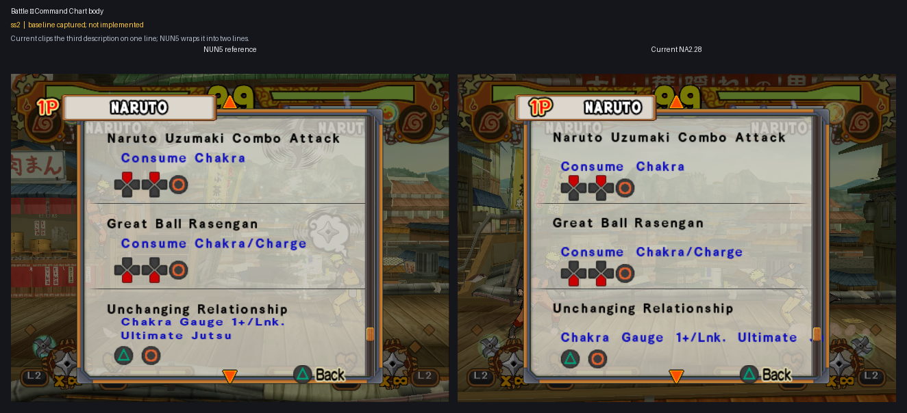
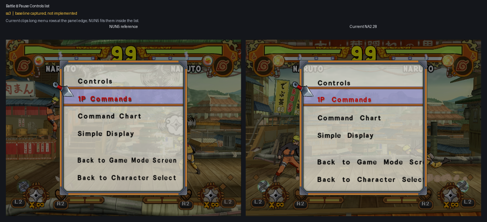

# ss1–ss6 layout parity

User-declared Font epic covering the matched NUN5/NA2.28 savestate pairs in
slots 1 through 6. Slots 2–6 formed the original declaration; the user added
the remade Special Controls slot 1 pair on 2026-07-27. The epic runs in an
efficiency-prioritized sequential mode: implement one slot, commit and push it, present its
NUN5-left/Current-NA2-right result, then wait for explicit user acceptance
before beginning the next slot.

## Scope and evidence

- Declared: 2026-07-27.
- Inputs:
  `work/Font/inputs/sstates/epics/ss2-6/`.
- Additional remade ss1 inputs:
  `work/Font/inputs/sstates/special-controls-on-off/remade-ss1-20260727/`.
- Extracted source screenshots:
  `work/Font/inputs/screenshots/epics/ss2-6/`.
- Provenance:
  `work/Font/inputs/sstates/epics/ss2-6/provenance.tsv` and
  `work/Font/inputs/sstates/special-controls-on-off/remade-ss1-20260727/provenance.tsv`.
- Protected `@pcsx2_user` sources remain untouched.
- Status: all six baselines are captured; implementation has not started.
- Existing accepted Font and resident-renderer behavior remains the regression
  baseline. The accepted Command Chart title is not reopened by ss2; ss2 owns
  only the remaining command-body layout.
- Text-content differences are routed to the translation workstreams. This
  epic owns measurement, wrapping, fitting, positioning, and clipping only.

## Battle

### ss1 — Special Controls final selector

- State: ASCII source confirmed; renderer parity deferred to this epic.
- Remaining defect: Current draws the final `On`/`Off` selector with physically
  larger glyphs and wider advances than NUN5. Both live tables are already
  ASCII, and an `Off`/`On` to `OFF`/`ON` redirect changed zero modal pixels, so
  this case requires a renderer-scale/advance fix rather than another string
  conversion.

### ss2 — Command Chart body

- State: baseline captured; not implemented.
- Remaining defect: the third Current description remains on one clipped line,
  while NUN5 wraps it into two lines inside the command panel.

### ss3 — Pause Controls list

- State: baseline captured; not implemented.
- Remaining defect: Current long menu rows run beyond the panel edge, while
  NUN5 fits them within the list.

### ss4 — Quit confirmation

- State: baseline captured; not implemented.
- Remaining defect: Current keeps the confirmation body on one overflowing
  line, while NUN5 wraps it into two lines; the Yes/No row placement also
  differs.

## Collection

### ss5 — Character model move list

- State: baseline captured; not implemented.
- Remaining defect: Current overflows the long move name, while NUN5 wraps it
  inside the right-side column.

### ss6 — Movie list

- State: baseline captured; not implemented.
- Remaining defect: Current movie titles remain single-line and overflow,
  while NUN5 uses variable-height wrapped rows.

## Efficiency-prioritized sequential plan

1. **ss1 — Special Controls final selector.** Reuse the accepted Controls core
   through a dedicated final-selector adapter, matching glyph scale and
   advance together without changing either ASCII literal family or reopening
   the accepted first-eight Controls rows.
2. **ss3 — Pause Controls list.** The retained disabled shared UI helper
   already proves the 216-unit shrink-only box and Y correction. Rebuild that
   behavior through the v2 architecture first because it establishes reusable
   plumbing for ss4 with the least new logic.
3. **ss4 — Quit confirmation.** Reuse the ss3 plumbing and add only the
   separately guarded confirmation-body and Yes/No positioning behavior.
4. **ss2 — Command Chart body.** Reuse the accepted multiline primitives, but
   treat the command-description loop as its own caller family and leave the
   accepted title untouched.
5. **ss5 — Character model move list.** Add bounded wrapping and positioning
   for the right-side move-name column.
6. **ss6 — Movie list.** Implement variable-height wrapped rows last because
   this case has the greatest caller-specific row-advance and layout burden.

Shared primitives are implemented only once. Each slot still receives its own
guarded caller, commit/push boundary, result grid, and explicit acceptance; a
shared implementation does not merge the six review decisions.
