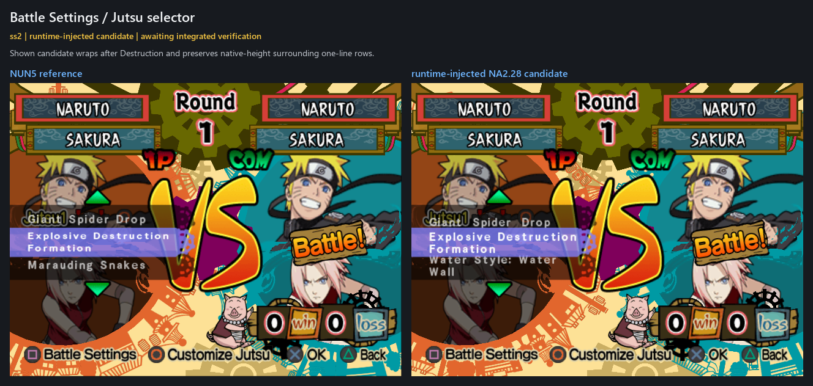
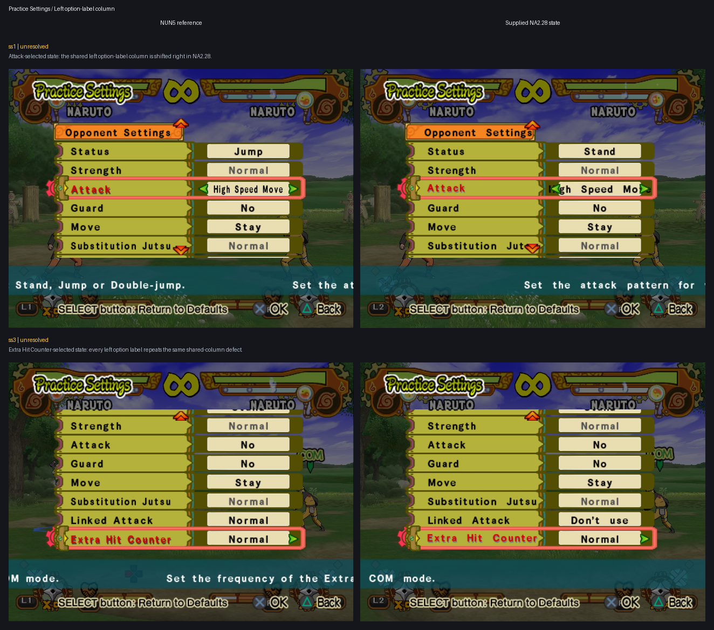
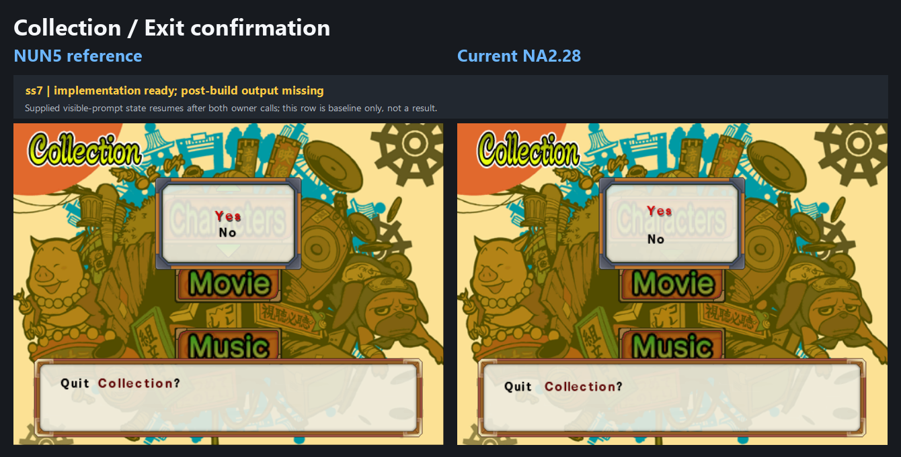
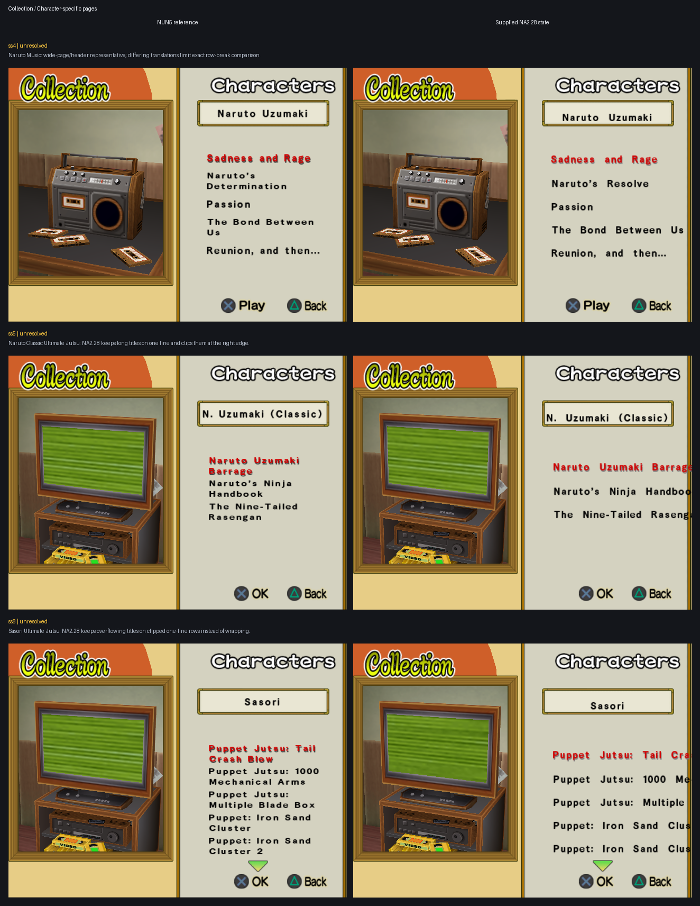
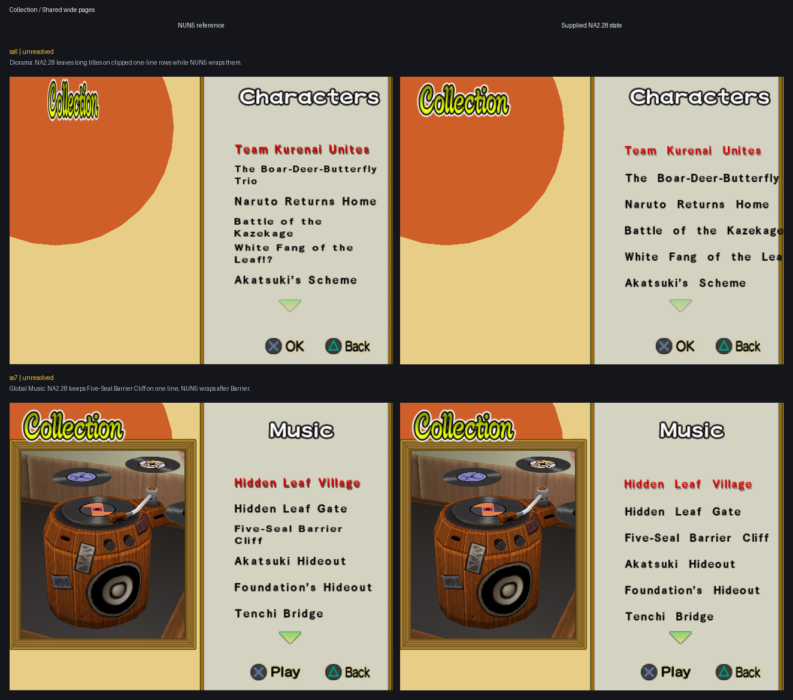

# Layout parity batches

User-declared Font epic covering matched NUN5/NA2.28 layout cases. On
2026-07-30 the user replaced every prior active savestate with one new paired
ss1–10 batch and ordered the work to continue from it. The active evidence,
slot meanings, priorities, and grids below refer only to that replacement
batch. Work runs in efficiency-prioritized Continuous mode: implement one
case or proven shared caller family, commit and push it, visibly present its
NUN5-left/Current-NA2.28-right result, then proceed to the next actionable
case.

## Execution state

- Mode: Continuous, limited by the user's current authorization to the
  explicitly selected Priority 3 correction.
- Current subtask: Priority 3 — replacement ss1–ss2 Jutsu-selector evidence.
- Pending grid:
  `docs/workstreams/font/epics/ss2-6-layout/awaiting_approval/3-jutsu-selector.png`.
- Next action: preserve the shown runtime-injected candidate unchanged until
  its exact integrated ss1–ss2 result is built and explicitly user-verified.

## Scope and evidence

- Declared: 2026-07-27.
- Inputs: `work/Font/inputs/sstates/batches/2026-07-30-ss1-10/`.
- Extracted source screenshots:
  `work/Font/inputs/screenshots/batches/2026-07-30-ss1-10/`.
- State provenance and hashes:
  `work/Font/inputs/sstates/batches/2026-07-30-ss1-10/provenance.tsv`.
- Priority 3 replacement inputs:
  `work/Font/inputs/sstates/batches/2026-07-31-priority3-ss1-2/`.
- Priority 3 replacement source screenshots:
  `work/Font/inputs/screenshots/batches/2026-07-31-priority3-ss1-2/`.
- Priority 3 replacement provenance and hashes:
  `work/Font/inputs/sstates/batches/2026-07-31-priority3-ss1-2/provenance.tsv`.
- Supplemental Practice Settings ss3 inputs:
  `work/Font/inputs/sstates/batches/2026-07-31-practice-settings-ss3/`.
- Supplemental Practice Settings ss3 source screenshots:
  `work/Font/inputs/screenshots/batches/2026-07-31-practice-settings-ss3/`.
- Supplemental Practice Settings ss3 provenance and hashes:
  `work/Font/inputs/sstates/batches/2026-07-31-practice-settings-ss3/provenance.tsv`.
- Supplemental Practice Settings ss1 inputs:
  `work/Font/inputs/sstates/batches/2026-07-31-practice-settings-ss1/`.
- Supplemental Practice Settings ss1 source screenshots:
  `work/Font/inputs/screenshots/batches/2026-07-31-practice-settings-ss1/`.
- Supplemental Practice Settings ss1 provenance and hashes:
  `work/Font/inputs/sstates/batches/2026-07-31-practice-settings-ss1/provenance.tsv`.
- Supplemental Collection ss4–ss8 inputs:
  `work/Font/inputs/sstates/batches/2026-07-31-collection-ss4-8/`.
- Supplemental Collection ss4–ss8 source screenshots:
  `work/Font/inputs/screenshots/batches/2026-07-31-collection-ss4-8/`.
- Supplemental Collection ss4–ss8 provenance and hashes:
  `work/Font/inputs/sstates/batches/2026-07-31-collection-ss4-8/provenance.tsv`.
- Supplemental regression inputs:
  `work/Font/inputs/sstates/batches/2026-07-30-regressions/`.
- Supplemental extracted screenshots:
  `work/Font/inputs/screenshots/batches/2026-07-30-regressions/`.
- Supplemental provenance and hashes:
  `work/Font/inputs/sstates/batches/2026-07-30-regressions/provenance.tsv`.
- Original-batch compatible independent worker ISO provenance:
  `work/Font/inputs/sstates/batches/2026-07-30-ss1-10/iso_provenance.tsv`.
- Supplemental-batch compatible independent worker ISO provenance:
  `work/Font/inputs/sstates/batches/2026-07-30-regressions/iso_provenance.tsv`.
- Protected `@pcsx2_dev` sources remain untouched.
- Exact grouping: ss1 Character Select return confirmation; ss2 Linked Mode
  center modal; ss3–ss6 one Jutsu-selector defect, with ss3/ss4 supplied as
  precursors and ss5/ss6 showing the defect; ss7 Collection confirmation; ss8
  Movie list; ss9–ss10 character move lists.
- The supplemental pair reuses ss1 for the Character Select player-mode option
  list and ss2 for Linked Mode with `Manual` highlighted. It supplements rather
  than replaces the original batch: the original ss1 remains the accepted
  return-confirmation evidence.
- Supplemental ss3 is the current collapsed Jutsu-selector regression: the
  long selected title remains unwrapped, while native short one-line rows are
  the behavior that must be preserved.
- The 2026-07-31 paired ss1–ss2 batch supersedes the older Priority 3
  presentation evidence. Its ss1 is the collapsed Jutsu list and its ss2 is
  the expanded list. Older ss3–ss6 states remain only as regression evidence
  for the same caller family.
- The 2026-07-31 paired ss3 state is a separate Practice Settings list case.
  It is not part of Priority 3 and does not replace any Jutsu-selector input.
- The 2026-07-31 paired ss1 state is a second view of that same Practice
  Settings caller family with `Attack` selected. Together, ss1 and ss3 prove
  that the left-column defect is shared across selected rows and surrounding
  ordinary labels; ss1 is not a new priority and is not part of Priority 3.
- The 2026-07-31 paired Collection batch adds ss4 Naruto
  character-specific Music, ss5 Naruto Classic Ultimate Jutsu, ss6 Diorama,
  ss7 global Music, and ss8 Sasori ordinary-character Ultimate Jutsu. These
  are representative families for one future structural Collection-list
  correction, not five per-character implementations.
- The user-supplied NA2.28 Characters-index screenshot is retained beside the
  Collection batch as `character-index_NA228.png`. The user reports no Font
  defect there, so it is reference-only and has no paired baseline grid.
- Every slot is loaded directly. The user supplied the exact Priority 3
  constructor sequence ss3 -> Cross -> ss4 -> Circle -> ss5 -> Cross -> ss6,
  but the final draw-time caller executes after direct ss5 and ss6 reloads, so
  no agent navigation was required.
- Existing accepted Font and resident-renderer behavior remains the regression
  baseline.
- Text-content differences are normally routed to the translation workstreams.

## Character Select

### Priority 1 — ss1: Return confirmation

- State: accepted lower-body fix retained; isolated top-selector fix is
  committed, pushed, agent-validated, visibly delivered, and user-verified on
  2026-07-30.
- Result: the scoped top Yes/No list has the same offsets from its modal origin
  as NUN5 while the accepted lower body remains unchanged.

### Priority 2 — supplemental ss1–ss2: Character Select option lists

- State: implemented, canonically validated, agent-validated, visibly
  delivered, and user-accepted on 2026-07-30.
- ss1: the highlighted first player-mode row remains unchanged. The ordinary
  rows already had exact NUN5 Y bounds, but bypassed the selected row's
  NUN5-metric session, making them eight or nine pixels too wide and six pixels
  too far left. Their dedicated ordinary callback now enters the same bounded
  240-unit session and five-local-unit X correction while retaining native Y.
  All three visible ordinary rows now match NUN5 bounds exactly.
- ss2: the title stays at local Y `8`; one shared `46 + 20*i` choice formula,
  with no selected-only compensation, gives exact NUN5 Y bounds for selected
  `Manual` and ordinary `Auto`.
- The verified return-confirmation family and every unrelated caller remain
  unchanged.

## Battle Settings / Jutsu selector

### Priority 3 — replacement ss1–ss2: One Jutsu-selector defect

- State: a runtime-injected C candidate was produced and visibly shown on
  2026-07-31. The candidate is not an integrated result, its C implementation
  remains uncommitted, and integrated ss1–ss2 validation plus explicit user
  acceptance remain pending.
- ss1: fitting one-line rows are shifted right in NA2.28.
- ss2: the effective text box is too narrow. NUN5 wraps `Explosive Destruction
  Formation` after `Destruction`, while NA2.28 wraps after `Explosive`.
- ss2: the wrapped text is also too narrow vertically in NA2.28.
- Shown candidate evidence: ss2 wraps after `Destruction`, preserves
  native-height surrounding one-line rows, and was copied unchanged to
  `work/Font/artifacts/priority3_jutsu_selector/replacement_2026-07-31/ss02_runtime_injected_candidate.png`.
- Required result: preserve native/NUN5 glyph height, move fitting one-line
  rows to the NUN5 X origin, and use the NUN5 effective width, line break, and
  vertical glyph geometry for titles that actually wrap.
- Older ss3–ss6 states remain regression inputs for the same caller family;
  they do not override the replacement pair.

## Practice Settings

### Priority 7 — supplemental ss1 and ss3: Left option-label column

- State: unresolved paired baselines added on 2026-07-31; this case is not
  selected for implementation by the current Priority 3 authorization.
- ss1: `Attack` is selected. The selected row and every surrounding ordinary
  left-column label reproduce the same right-shifted NA2.28 origin.
- ss3: `Extra Hit Counter` is selected. Every visible left-column label again
  starts farther right in NA2.28 than in NUN5.
- Every visible left-column option label starts 9–10 native pixels farther
  right in the measured ss3 pair. The ss1 pair independently proves the same
  shared-column direction and scope.
- Ordinary-row glyph Y bounds match NUN5. The right value column, differing
  option values, lower explanation text, and the accepted native selected-row
  movement behavior are outside this exact alignment case.
- Required result: move only the Practice Settings left option-label column
  to the NUN5 X origin while preserving its current Y positions, selected
  styling, right value column, title, footer, and explanation paths.

## Collection

### Priority 4 — ss7: Exit confirmation

- State: unresolved. Commit `76e5023f` installed bounded C/file-backed hooks
  and the current profile composes, but the accurate integrated-game grid below
  still shows an unacceptable result. Existing code and successful composition
  do not make this subtask implemented.
- Remaining defect: the displayed prompt/body and choice layout still fail the
  requested NUN5 match. The existing grid is the authoritative failing
  evidence; the user does not need to reproduce it.
- Remaining action: diagnose and change the actual Priority 4 result when the
  user authorizes returning to this subtask. Do not replace the grid with a
  missing-input claim.

### Priority 5 — ss8: Movie list

- State: corrected in canonical C, compose-validated, and exercised as a
  runtime-injected candidate on the supplied ss8 state. The user then verified
  the exact integrated-ISO result on 2026-07-30. The previous
  nonrepresentative grid remains removed, and no accepted grid is retained.
- Implemented result: one-line Movie rows bypass the wrapper completely. Only
  titles that actually wrap use the 192-unit two-line layout and 16-unit line
  interval; those wrapped rows retain native glyph geometry instead of
  receiving the 20-unit glyph-height override. Selection style, source strings,
  fixed caller cadence, character-detail branches, and every non-Movie caller
  remain unchanged.
- Evidence: development injection established the candidate appearance; the
  user's subsequent integrated-ISO verification establishes the accepted
  shipped result.

### Priority 6 — ss9–ss10: Character move lists

- State: corrected in canonical C/static core and agent-validated as a
  runtime-injected candidate. The user explicitly accepted the exact ss9 target
  appearance on 2026-07-30. Exact integrated-ISO confirmation remains pending,
  and the previous nonrepresentative grid remains removed.
- Root cause: the compatible development ISO retained the older right-edge
  session shim, which ignored the character branch's `0x40` glyph-quad flag.
  The integrated payload used the newer flag-aware shim, whose conditional
  branch loaded `session.glyph_height` from its MIPS delay slot even when the
  flag was clear. Development therefore appeared correct while the integrated
  rows were squeezed.
- Implemented result: the shared hook now uses a NOP delay slot and loads
  `glyph_height` only on its flagged path. Character rows retain
  `glyph_height = 20` solely for two-line box centering but no longer set the
  glyph-quad flag. Their accepted 152- or 192-unit boxes, native X, Y minus 10,
  required line breaks, and 16-unit line interval are unchanged.
- Candidate evidence: fresh ss9 and ss10 captures through the corrected modern
  hook reproduce every retained target text group's native-resolution bounds
  and glyph-pixel counts exactly. A supplied ss8 regression reproduces the
  accepted Movie right panel pixel-for-pixel. Non-text animation pixels are not
  part of that identity claim.
- Evidence requirement: the canonical result grid still requires untouched
  NUN5 and exact integrated-ISO ss9/ss10 captures at native resolution.

### Priority 8 — supplemental ss4–ss8: Shared Collection lists

- State: unresolved paired baselines added on 2026-07-31. Implementation is
  deferred until the remaining isolated epic cases are finished.
- ss4: Naruto character-specific Music is the wide character-page and shared
  name-header representative. Its differing English translations prevent
  exact row-break comparison, so it remains a scope and regression input.
- ss5: Naruto Classic Ultimate Jutsu proves the legacy-character path keeps
  long titles on one line and clips them at the right edge instead of using
  NUN5 wrapping.
- ss6: Diorama uses the shared wide dimensions, but NA2.28 leaves its long
  titles on clipped one-line rows while NUN5 wraps them.
- ss7: global Music uses the same wide dimensions. NUN5 wraps
  `Five-Seal Barrier Cliff` after `Barrier`; NA2.28 keeps it on one line.
- ss8: Sasori Ultimate Jutsu proves the ordinary-character path likewise
  keeps every overflowing title on a clipped one-line row.
- Required result: classify the shared ETC page family structurally rather
  than by character or string; retain the narrow `152`-unit Figure profile,
  use the shared `192`-unit profile for the other listed families, preserve
  native glyph height for fitting one-line and multiline output, and wrap only
  measured overflow. Fix the shared character-name header once, with accepted
  Movie and Figure behavior retained as regressions.

## Current priorities

Priority is determined by the most efficient implementation order.

1. **ss1 — Character Select return confirmation.** User-verified.
2. **supplemental ss1–ss2 — Character Select option lists.** User-accepted.
3. **replacement ss1–ss2 — one Jutsu-selector defect.** Unresolved and
   selected: fitting rows are shifted right, the effective box is too narrow
   for NUN5's `Explosive Destruction` / `Formation` break, and wrapped text is
   vertically squeezed.
4. **ss7 — Collection exit confirmation.** Unresolved: the accurate integrated
   grid still shows an unacceptable result despite the enabled hooks and
   successful composition.
5. **ss8 — Movie list.** Corrected, compose-validated, and user-verified on the
   integrated ISO on 2026-07-30. One-line rows and fitting wrapped rows retain
   native glyph height; the previous nonrepresentative grid remains removed.
6. **ss9–ss10 — Character move lists.** Corrected and candidate-validated
   against the user-accepted target. The previous nonrepresentative grid is
   removed; exact integrated-ISO ss9/ss10 evidence is pending.
7. **supplemental ss1 and ss3 — Practice Settings left option-label
   column.** Unresolved paired baselines: both selected rows and their
   surrounding ordinary labels expose the same shared right-shifted column,
   while ordinary-row vertical bounds already match NUN5.
8. **supplemental ss4–ss8 — shared Collection lists.** Unresolved paired
   baselines retained for one deferred structural classifier: Figure remains
   the sole narrow profile, the other representative lists share the wide
   profile, and only measured overflow wraps.

Shared primitives are implemented only once. Each prioritized caller family
receives one guarded implementation and commit/push boundary; every case keeps
its own result evidence and explicit acceptance.
