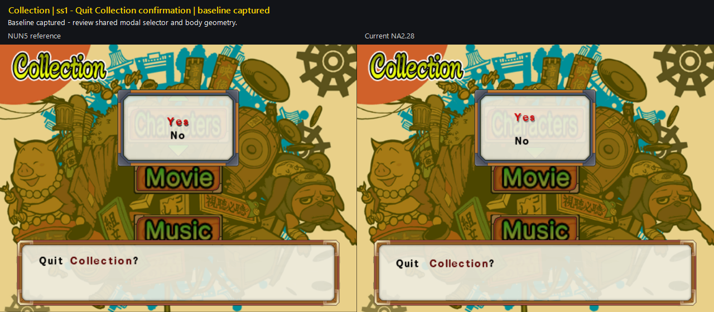
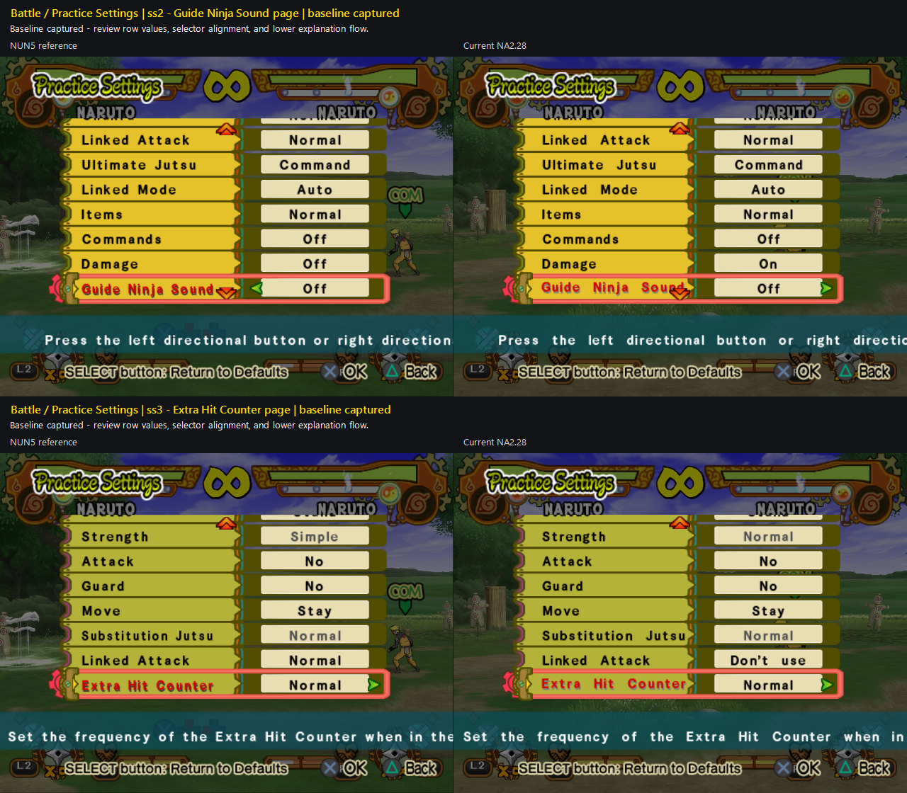
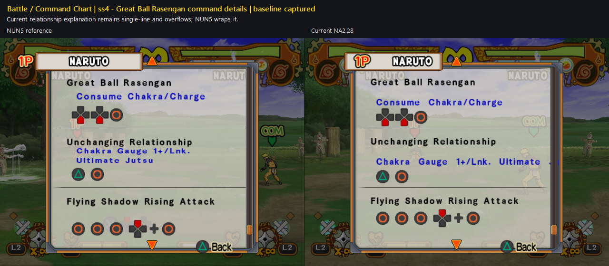
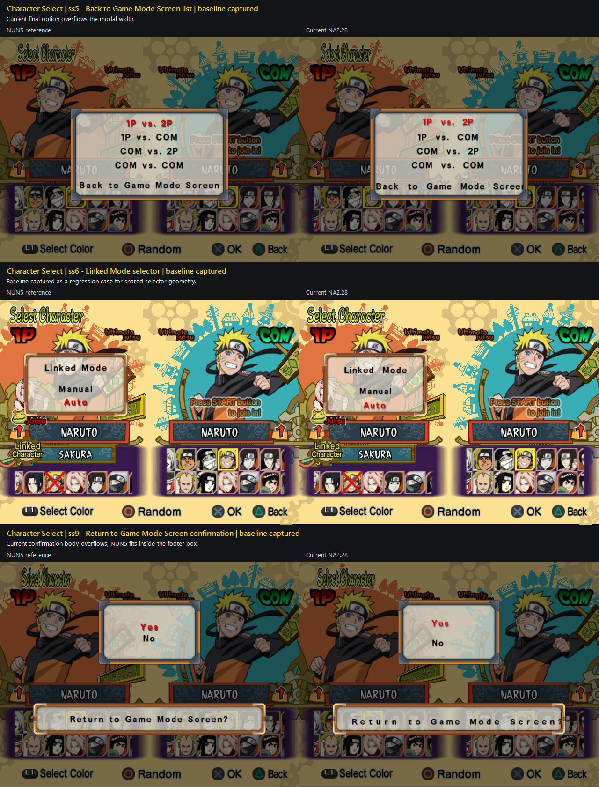
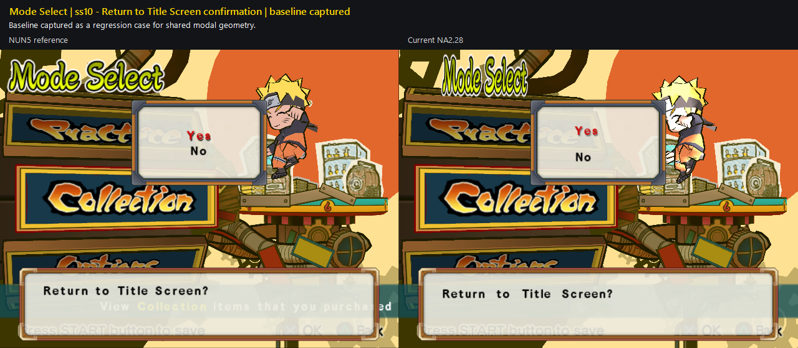

# Layout parity batches

User-declared Font epic covering matched NUN5/NA2.28 layout cases. Slots 2–6
formed the original declaration; the user later added and accepted the remade
Special Controls slot 1 pair. On 2026-07-27 the user added a distinct new
matched batch in slots 1–10. The epic runs in efficiency-prioritized sequential
mode: implement one case or proven shared caller family, commit and push it,
present its NUN5-left/Current-NA2-right result, then wait for explicit user
acceptance before beginning the next case.

## Scope and evidence

- Declared: 2026-07-27.
- Inputs:
  `work/Font/inputs/sstates/epics/ss2-6/` and
  `work/Font/inputs/sstates/batches/2026-07-27-ss1-10/`.
- Extracted source screenshots:
  `work/Font/inputs/screenshots/epics/ss2-6/` and
  `work/Font/inputs/screenshots/batches/2026-07-27-ss1-10/`.
- Provenance:
  `work/Font/inputs/sstates/epics/ss2-6/provenance.tsv` and
  `work/Font/inputs/sstates/batches/2026-07-27-ss1-10/provenance.tsv`.
- Protected `@pcsx2_user` sources remain untouched.
- Status: the remade ss2 and ss3 pair records the same Pause Controls modal in
  normal and selected states. Both are user-verified and removed from the
  remaining report. The shared quit-confirmation and ss1 Special Controls cases
  are also user-verified and removed. The original batch retains two cases and
  the new batch contributes ten baseline cases; twelve cases remain.
- Existing accepted Font and resident-renderer behavior remains the regression
  baseline. The previously retained Command Chart ss2 image was superseded by
  the remade Pause Controls ss2 state and is no longer an epic input.
- Text-content differences are normally routed to the translation workstreams.

## Collection

### Original ss5 — Character model move list

- State: baseline captured; not implemented.
- Remaining defect: Current overflows the long move name, while NUN5 wraps it
  inside the right-side column.

### Original ss6 — Movie list

- State: baseline captured; not implemented.
- Remaining defect: Current movie titles remain single-line and overflow,
  while NUN5 uses variable-height wrapped rows.

### New batch ss1 — Quit Collection confirmation

- State: baseline captured; not implemented.
- Review target: shared modal selector and body geometry.

## Battle / Practice Settings

### New batch ss2–ss3 — Settings rows and explanations

- State: two matched baselines captured; not implemented.
- Review targets: row-value geometry, selection alignment, and lower
  explanatory-text flow. Content differences remain translation-owned.

## Battle / Command Chart

### New batch ss4 — Great Ball Rasengan command details

- State: baseline captured; not implemented.
- Remaining defect: Current keeps the relationship explanation on one line and
  overflows; NUN5 wraps it within the command-details panel.

## Character Select

### New batch ss5, ss6, and ss9 — Shared selection/modal family

- State: three matched baselines captured; not implemented.
- ss5: Current's final `Back to Game Mode Screen` option overflows the modal.
- ss6: Linked Mode is retained as a regression case for shared selector
  geometry.
- ss9: Current's return-confirmation body overflows while NUN5 fits it inside
  the footer box.

## Battle Settings / Customize Jutsu

### New batch ss7–ss8 — Jutsu-name list

- State: two matched baselines captured; not implemented.
- Remaining defect: Current selected and expanded-list titles overflow
  horizontally; NUN5 wraps them inside the left-side list bounds.

## Mode Select

### New batch ss10 — Return to Title Screen confirmation

- State: baseline captured; not implemented.
- Review target: regression coverage for the shared modal geometry.

## Efficiency-prioritized sequential plan

1. **New ss4 — Command Chart details.** Reuse the established command/practice
   text-flow primitives for the bounded relationship explanation.
2. **New ss7–ss8 — Jutsu-name list.** Resolve the shared selected/list title
   family once, then validate both states.
3. **New ss5 and ss9 — Character Select modal text.** Address the overflowing
   list entry and confirmation body while keeping new ss6 as regression proof.
4. **New ss1 and ss10 — Shared confirmation regression.** Confirm whether the
   existing modal adapters already provide parity before adding any caller.
5. **New ss2–ss3 — Practice Settings review.** Separate translation-owned
   content differences from remaining Font geometry before patching.
6. **Original ss5 — Character model move list.** Add bounded wrapping and
   positioning for the right-side move-name column.
7. **Original ss6 — Movie list.** Implement variable-height wrapped rows last
   because this case has the greatest caller-specific row-advance burden.

Shared primitives are implemented only once. Each slot still receives its own
guarded caller, commit/push boundary, result grid, and explicit acceptance; a
shared implementation does not merge the six review decisions.
