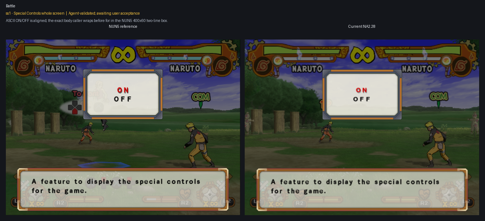
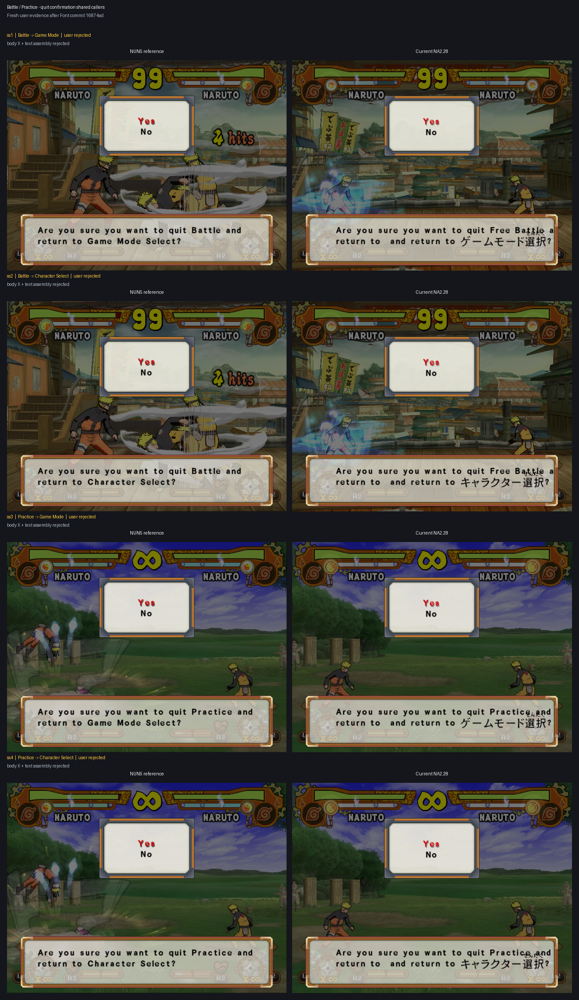
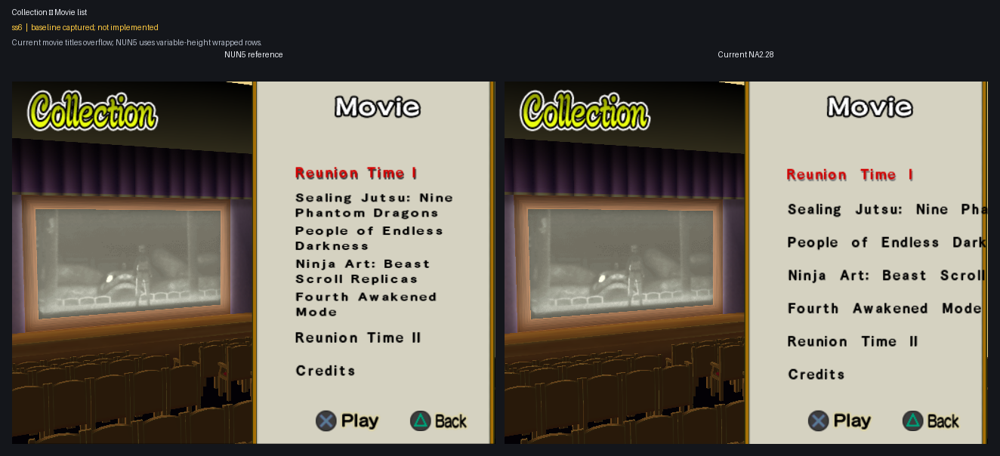

# ss1–ss6 layout parity

User-declared Font epic covering the matched NUN5/NA2.28 savestate pairs in
slots 1 through 6. Slots 2–6 formed the original declaration; the user added
the remade Special Controls slot 1 pair on 2026-07-27. The epic runs in an
efficiency-prioritized sequential mode: implement one slot, commit and push it, present its
NUN5-left/Current-NA2-right result, then wait for explicit user acceptance
before beginning the next slot.

## Scope and evidence

- Declared: 2026-07-27.
- Inputs:
  `work/Font/inputs/sstates/epics/ss2-6/`.
- Fresh four-context quit-confirmation inputs:
  `work/Font/inputs/sstates/epics/ss2-6/ss4-shared-callers-20260727/`.
- Additional remade ss1 inputs:
  `work/Font/inputs/sstates/special-controls-on-off/remade-ss1-20260727/`.
- Extracted source screenshots:
  `work/Font/inputs/screenshots/epics/ss2-6/`.
- Provenance:
  `work/Font/inputs/sstates/epics/ss2-6/provenance.tsv` and
  `work/Font/inputs/sstates/special-controls-on-off/remade-ss1-20260727/provenance.tsv`.
- Protected `@pcsx2_user` sources remain untouched.
- Status: the remade ss2 and ss3 pair records the same Pause Controls modal in
  normal and selected states. Both are user-verified and removed from the
  remaining report; four epic cases remain.
- Existing accepted Font and resident-renderer behavior remains the regression
  baseline. The previously retained Command Chart ss2 image was superseded by
  the remade Pause Controls ss2 state and is no longer an epic input.
- Text-content differences are routed to the translation workstreams. This
  epic owns measurement, wrapping, fitting, positioning, and clipping only.

## Battle

### ss1 — Special Controls final selector

- State: ASCII source confirmed; renderer parity deferred to this epic.
- Remaining defect: Current draws the final `On`/`Off` selector with physically
  larger glyphs and wider advances than NUN5. Both live tables are already
  ASCII, and an `Off`/`On` to `OFF`/`ON` redirect changed zero modal pixels, so
  this case requires a renderer-scale/advance fix rather than another string
  conversion.

### ss4 — Quit confirmation

- State: the first caller-local implementation reaches all four supplied
  Battle/Practice and Game Mode/Character Select combinations, but the user
  rejected its body placement and exposed a separate text-assembly defect.
- Fresh evidence: the user remade a four-pair verification batch in slots
  1–4. The exact copied states, screenshots, hashes, and context labels are
  recorded under
  `work/Font/inputs/sstates/epics/ss2-6/ss4-shared-callers-20260727/`.
- Font defect: all four Current bodies begin at screenshot X `101`, while all
  four NUN5 bodies begin at X `72`. Their first-line Y origin already matches
  at `381`, so the next Font correction is one shared 29-pixel left shift
  without a vertical change.
- String defect: Battle wrongly says `Free Battle`; all four bodies duplicate
  connective text and retain their Japanese destination tail. The context
  selector itself still distinguishes Game Mode from Character Select. String
  Translation owns that correction; canonical mappings must not gain authored
  newline bytes.
- Implementation: T63–T67 and every canonical mapping remain unchanged. The
  exact Battle-modal body call wraps a bounded stack copy into two lines at
  draw time, while the exact Yes/No list call publishes a transient scope for
  selected and unselected NUN5-coordinate adapters.

## Collection

### ss5 — Character model move list

- State: baseline captured; not implemented.
- Remaining defect: Current overflows the long move name, while NUN5 wraps it
  inside the right-side column.

### ss6 — Movie list

- State: baseline captured; not implemented.
- Remaining defect: Current movie titles remain single-line and overflow,
  while NUN5 uses variable-height wrapped rows.

## Efficiency-prioritized sequential plan

1. **ss4 — Quit confirmation.** Reuse the accepted Pause Controls plumbing and add only the
   separately guarded confirmation-body and Yes/No positioning behavior.
2. **ss1 — Special Controls final selector.** Reuse the accepted Controls core
   through a dedicated final-selector adapter, matching glyph scale and
   advance together without changing either ASCII literal family or reopening
   the accepted first-eight Controls rows.
3. **ss5 — Character model move list.** Add bounded wrapping and positioning
   for the right-side move-name column.
4. **ss6 — Movie list.** Implement variable-height wrapped rows last because
   this case has the greatest caller-specific row-advance and layout burden.

Shared primitives are implemented only once. Each slot still receives its own
guarded caller, commit/push boundary, result grid, and explicit acceptance; a
shared implementation does not merge the six review decisions.
