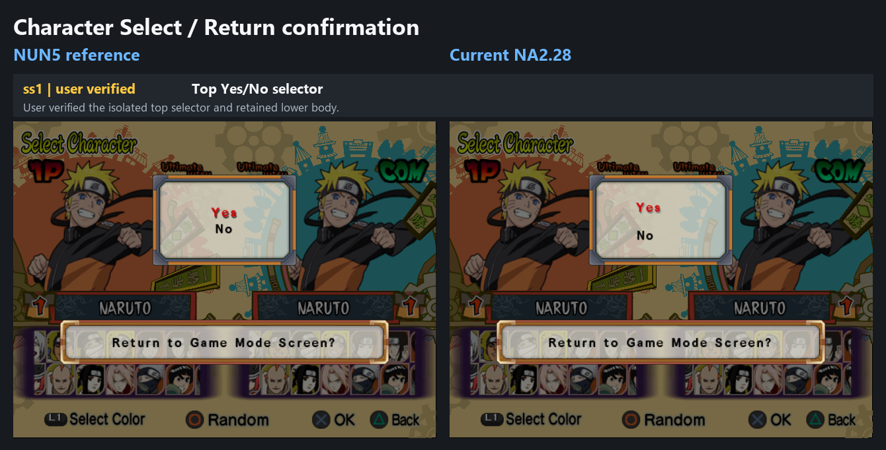
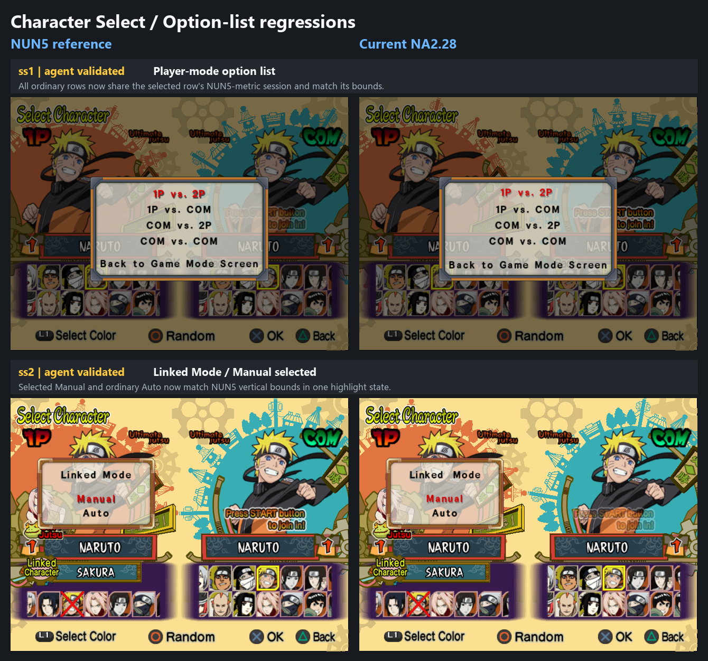
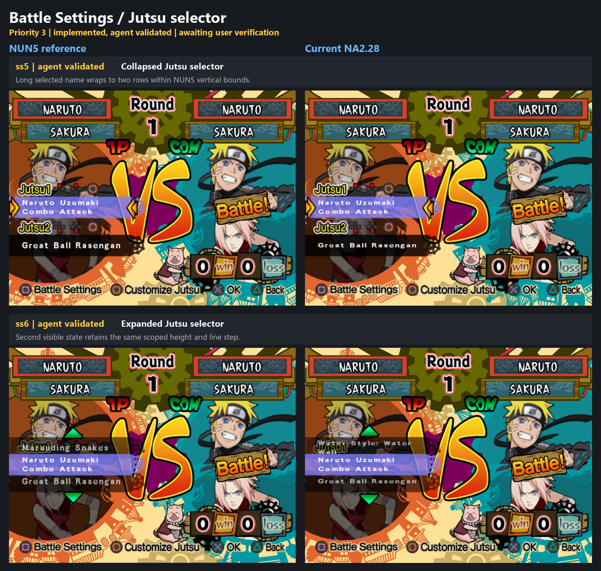
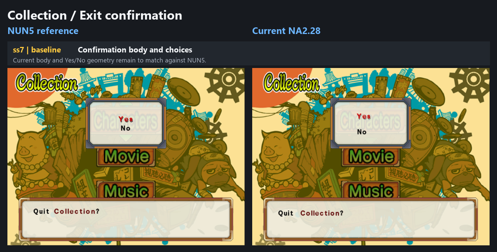
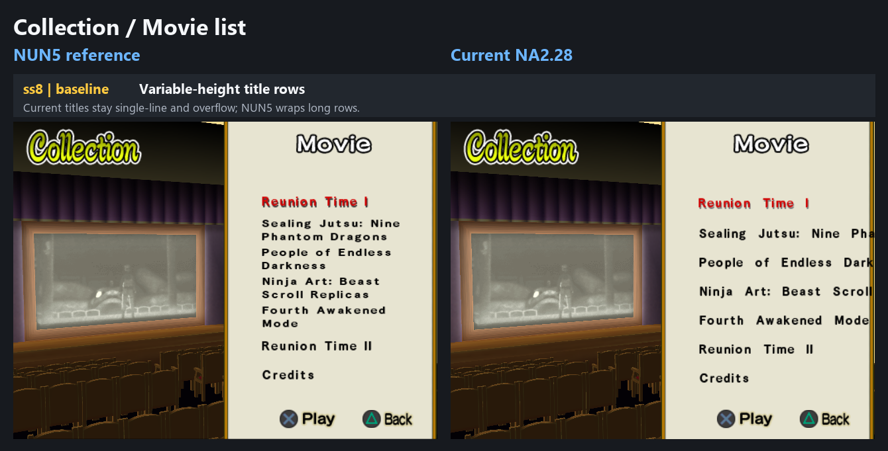
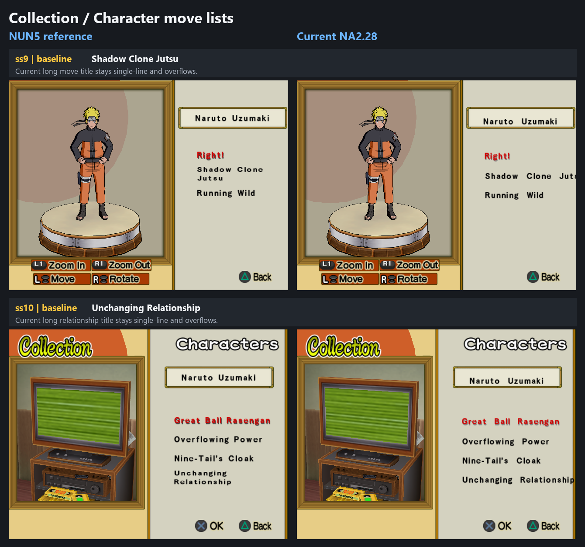

# Layout parity batches

User-declared Font epic covering matched NUN5/NA2.28 layout cases. On
2026-07-30 the user replaced every prior active savestate with one new paired
ss1–10 batch and ordered the work to continue from it. The active evidence,
slot meanings, priorities, and grids below refer only to that replacement
batch. Work runs in efficiency-prioritized Continuous mode: implement one
case or proven shared caller family, commit and push it, visibly present its
NUN5-left/Current-NA2.28-right result, then proceed to the next actionable
case.

## Execution state

- Mode: Continuous.
- Current subtask: Priority 3 — ss3–ss6 selective Jutsu-selector wrapping.
  Priority 2 implementation, canonical validation, and agent runtime evidence
  are complete; its grid remains pending visible delivery.
- Pending grid:
  `docs/workstreams/font/epics/ss2-6-layout/2-linked-mode-modal.png`.
- Next action: visibly deliver Priority 2, then continue Priority 3 without
  waiting for Priority 2 acceptance.

## Scope and evidence

- Declared: 2026-07-27.
- Inputs: `work/Font/inputs/sstates/batches/2026-07-30-ss1-10/`.
- Extracted source screenshots:
  `work/Font/inputs/screenshots/batches/2026-07-30-ss1-10/`.
- State provenance and hashes:
  `work/Font/inputs/sstates/batches/2026-07-30-ss1-10/provenance.tsv`.
- Supplemental regression inputs:
  `work/Font/inputs/sstates/batches/2026-07-30-regressions/`.
- Supplemental extracted screenshots:
  `work/Font/inputs/screenshots/batches/2026-07-30-regressions/`.
- Supplemental provenance and hashes:
  `work/Font/inputs/sstates/batches/2026-07-30-regressions/provenance.tsv`.
- Original-batch compatible independent worker ISO provenance:
  `work/Font/inputs/sstates/batches/2026-07-30-ss1-10/iso_provenance.tsv`.
- Supplemental-batch compatible independent worker ISO provenance:
  `work/Font/inputs/sstates/batches/2026-07-30-regressions/iso_provenance.tsv`.
- Protected `@pcsx2_dev` sources remain untouched.
- Exact grouping: ss1 Character Select return confirmation; ss2 Linked Mode
  center modal; ss3–ss6 one Jutsu-selector defect, with ss3/ss4 supplied as
  precursors and ss5/ss6 showing the defect; ss7 Collection confirmation; ss8
  Movie list; ss9–ss10 character move lists.
- The supplemental pair reuses ss1 for the Character Select player-mode option
  list and ss2 for Linked Mode with `Manual` highlighted. It supplements rather
  than replaces the original batch: the original ss1 remains the accepted
  return-confirmation evidence.
- Supplemental ss3 is the current collapsed Jutsu-selector regression: the
  long selected title remains unwrapped, while native short one-line rows are
  the behavior that must be preserved.
- Every slot is loaded directly. The user supplied the exact Priority 3
  constructor sequence ss3 -> Cross -> ss4 -> Circle -> ss5 -> Cross -> ss6,
  but the final draw-time caller executes after direct ss5 and ss6 reloads, so
  no agent navigation was required.
- Existing accepted Font and resident-renderer behavior remains the regression
  baseline.
- Text-content differences are normally routed to the translation workstreams.

## Character Select

### Priority 1 — ss1: Return confirmation

- State: accepted lower-body fix retained; isolated top-selector fix is
  committed, pushed, agent-validated, visibly delivered, and user-verified on
  2026-07-30.
- Result: the scoped top Yes/No list has the same offsets from its modal origin
  as NUN5 while the accepted lower body remains unchanged.

### Priority 2 — supplemental ss1–ss2: Character Select option lists

- State: implemented, canonically validated, and agent-validated on 2026-07-30;
  visible delivery and explicit user acceptance remain pending.
- ss1: the highlighted first player-mode row remains unchanged. The ordinary
  rows already had exact NUN5 Y bounds, but bypassed the selected row's
  NUN5-metric session, making them eight or nine pixels too wide and six pixels
  too far left. Their dedicated ordinary callback now enters the same bounded
  240-unit session and five-local-unit X correction while retaining native Y.
  All three visible ordinary rows now match NUN5 bounds exactly.
- ss2: the title stays at local Y `8`; one shared `46 + 20*i` choice formula,
  with no selected-only compensation, gives exact NUN5 Y bounds for selected
  `Manual` and ordinary `Auto`.
- Remaining action: explicit user review only. The verified return-confirmation
  family and every unrelated caller remain unchanged.

## Battle Settings / Jutsu selector

### Priority 3 — ss3–ss6: One Jutsu-selector defect

- State: rejected and reopened by user evidence on 2026-07-30. The current
  enabled-off build does nothing in supplemental ss3. The earlier candidate
  also over-scoped its session height/advance changes to collapsed one-line
  strings that NUN5 leaves native.
- The canonical hook is currently disabled after the build-offset repair in
  `76f445f4`; its corrected BTL file offset is `0x90DC`.
- Corrected contract: preserve native short one-line rows exactly and invoke
  the NUN5-matched two-line box only when the selected title requires wrapping.
- Supplemental ss3 is the current collapsed target. Original ss5/ss6 remain
  retained evidence for the same long-title family in its other visible state.

## Collection

### Priority 4 — ss7: Exit confirmation

- State: bounded C/file-backed implementation is ready and its exact guards,
  compilation, relocation, and fragment reconstruction are agent-validated;
  clean-construction runtime output and user acceptance remain pending.
- Result design: route only ETC body object `+4` through the existing wrapped
  body primitive at local `(24,12)` in a 400-by-60 box, and scope only choice
  object `+8` through the accepted Yes/No mapper. Native Collection inputs
  `(50,24)` and `(50,56)` already match that mapper's source keys.
- Validation limitation: the supplied visible-prompt ss7 state resumes after
  both owner calls. Its baseline frame is retained below, but it cannot produce
  the required post-change result or validate clean modal construction.
- Remaining action: build the patch, enter the Collection exit prompt normally,
  and supply one fresh screenshot or savestate for the final result grid.

### Priority 5 — ss8: Movie list

- State: matched baseline captured; not implemented.
- Remaining defect: Current movie titles remain single-line and overflow,
  while NUN5 uses variable-height wrapped rows.

### Priority 6 — ss9–ss10: Character move lists

- State: two matched baselines captured; not implemented.
- Remaining defect: Current keeps long move and relationship titles on one
  line and overflows, while NUN5 wraps them within the move-list column.

## Current priorities

Priority is determined by the most efficient implementation order.

1. **ss1 — Character Select return confirmation.** User-verified.
2. **supplemental ss1–ss2 — Character Select option lists.** Implemented and
   agent-validated; visible delivery and explicit user acceptance are pending.
3. **ss3–ss6 — one Jutsu-selector defect.** Use ss5/ss6 as visible targets and
   supplemental ss3 as the collapsed target; preserve every native short
   one-line row and wrap only the NUN5-wrapped long selected title.
4. **ss7 — Collection exit confirmation.** Match its body and choice geometry
   without affecting the Character Select modal family.
5. **ss8 — Movie list.** Implement caller-specific variable-height wrapped
   rows.
6. **ss9–ss10 — Character move lists.** Reuse one bounded wrapping primitive
   for both long-title cases where the caller family is shared.

Shared primitives are implemented only once. Each prioritized caller family
receives one guarded implementation and commit/push boundary; every case keeps
its own result evidence and explicit acceptance.
