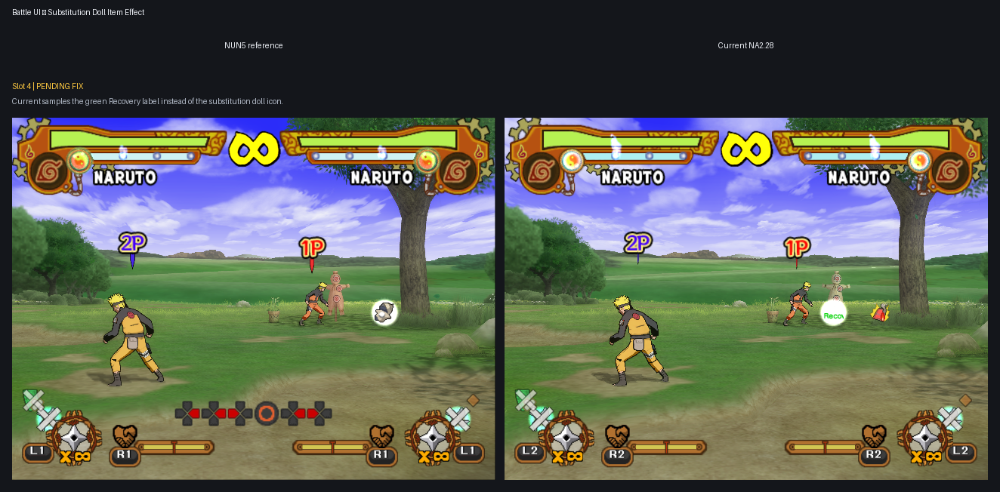

# Remaining UI Translation epic

Current report snapshot: 2026-07-31.

Every grid shows the official NUN5 reference on the left and Current NA2.28 on
the right.

Mode: Sequential

Current subtask: Battle item substitution doll, slot 4.

Pending grid: missing: integrated Current NA2.28 post-change screenshot for
the slot 4 substitution-doll fix.

## Remaining subtasks

- **Battle UI — substitution doll item effect, slot 4**
  - Status: corrected after the rejected record-`0x2E` implementation;
    integrated post-change capture pending.
  - Defect: Current samples the green `Recovery` label instead of the
    substitution doll icon shown by NUN5.
  - Preserved pair:
    `work/UI translation/inputs/sstates/battle_item_doll_ss04_20260731/`.
  - Provenance:
    `work/UI translation/inputs/sstates/battle_item_doll_ss04_20260731/provenance.tsv`.

## User-accepted completed cases

- Cross/Triangle labels: every preserved pair (original slots 1-5 and newer
  slots 1-3) was explicitly confirmed fixed by the user on 2026-07-26.
- Character Items transition: the user explicitly confirmed all five paired
  phases fixed on 2026-07-26.
- Victory winner character names: the user explicitly confirmed the expanded
  all-character donor coverage fixed on 2026-07-26.
- Ninja Song details footer: the user explicitly confirmed the corrected
  X/Next and Triangle/Back placement on 2026-07-26.
- Battle Results screen 2: the user explicitly confirmed the localized labels,
  title, moving clouds, footer, and all five rank stamps on 2026-07-26.
- Collection Music ss10: the user explicitly confirmed the complete
  Triangle/Stop group and its NUN5-matched footer anchor on 2026-07-27;
  Cross/Play remained unchanged and matched.
