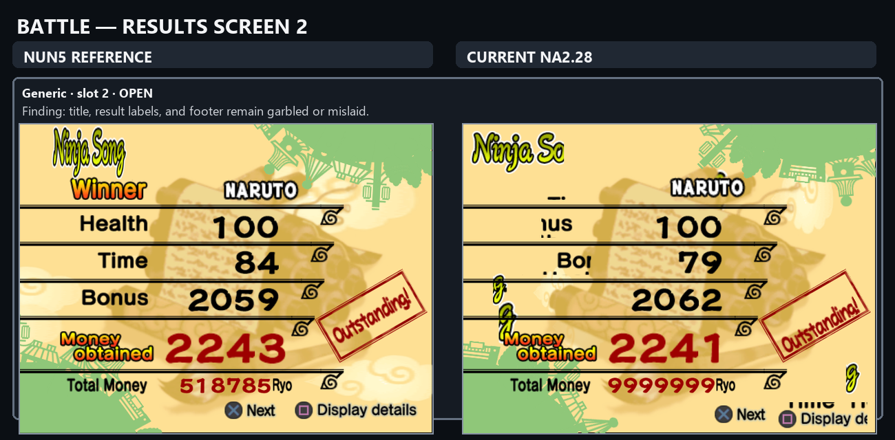
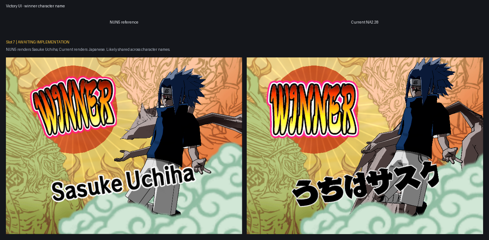
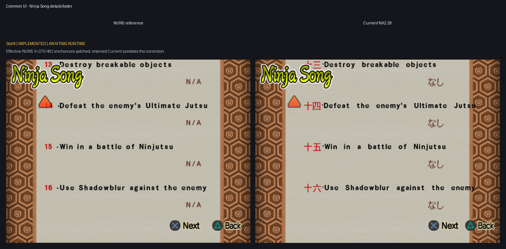

# Remaining UI Translation epic

Current report snapshot: 2026-07-26.

Every grid shows the official NUN5 reference on the left and Current NA2.28 on
the right.

## Remaining subtasks

1. Battle Results screen 2: labels, title, footer, and moving clouds are fixed;
   the red rank text remains pending runtime validation. A guarded
   `Outstanding!` trial matches NUN5 after shifting the complete five-label
   donor-atlas column upward by 11 source rows. The canonical donor-derived
   transform is implemented without an ISO build by user instruction; validate
   all five values through the next normal pipeline run.
2. Victory winner character name, ss7: implemented and agent-validated,
   awaiting the next normal pipeline runtime and user verification. The source
   inventory proved that the former implementation omitted 13 name-bearing
   character variants, including Sasuke's exact `3SSV3PCT.CCS`; all 13 now use
   complete official NUN5 donors. The retained Current screenshot predates
   this correction.
3. Ninja Song details footer, ss8: implemented and statically verified,
   awaiting the next normal pipeline runtime and user verification. The
   separate details renderer omitted NUN5's regional `-20` X/Next and `-8`
   Triangle/Back offsets; `UI-BTL-016` now uses effective X=`375`/`462`
   without changing the already-proven summary footer. The retained Current
   screenshot predates this correction.

## User-accepted completed cases

- Cross/Triangle labels: every preserved pair (original slots 1-5 and newer
  slots 1-3) was explicitly confirmed fixed by the user on 2026-07-26.
- Character Items transition: the user explicitly confirmed all five paired
  phases fixed on 2026-07-26.

## Report grids

### Battle results

### Victory

### Common UI

