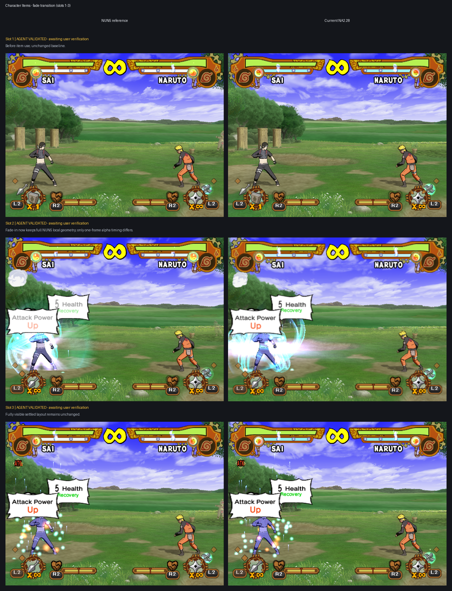
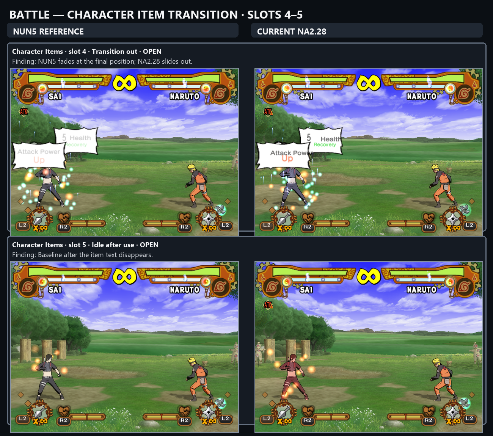
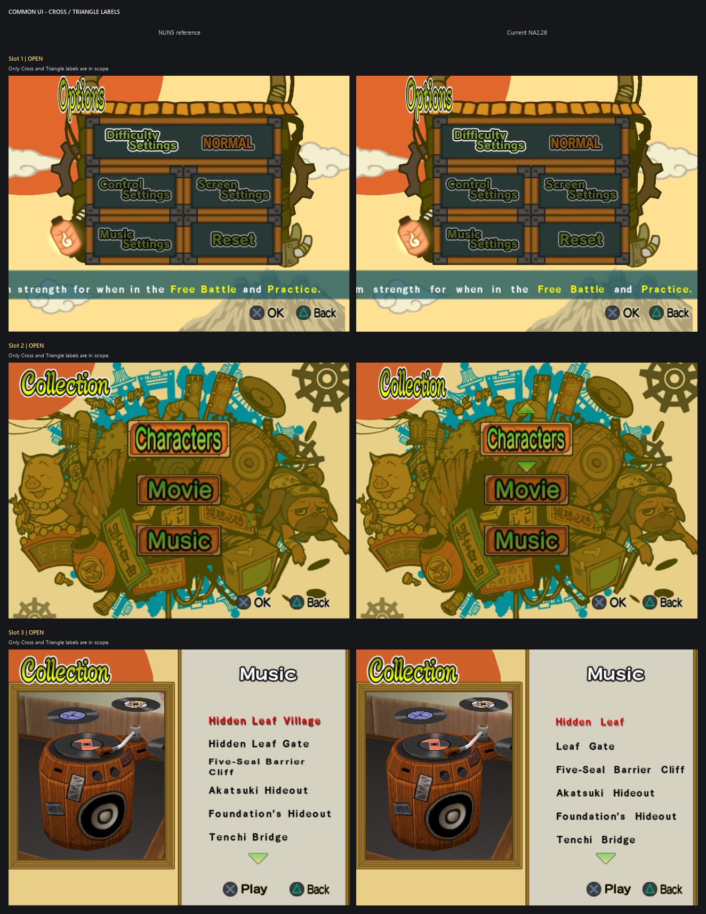
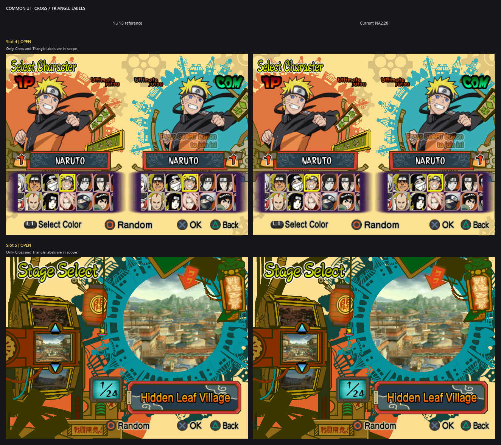

# Remaining UI Translation epic

Current report snapshot: 2026-07-26.

Every grid shows the official NUN5 reference on the left and Current NA2.28 on
the right.

## Remaining subtasks

1. Battle Results screen 2: repair the garbled and mislaid result UI.
2. Character Items transition: replace the NA2.28 slide with the NUN5/base-NA2
   fade behavior.
3. Cross/Triangle labels, paired slots 1-5: correct only the Cross and Triangle
   labels across the five preserved screens as one shared subtask.

## Report grids

### Battle results

### Character items

### Cross/Triangle labels

