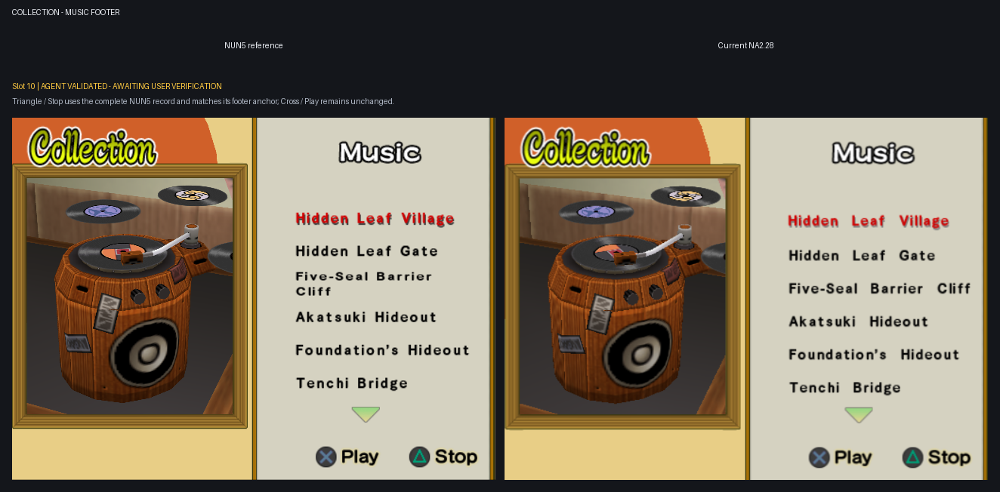

# Remaining UI Translation epic

Current report snapshot: 2026-07-26.

Every grid shows the official NUN5 reference on the left and Current NA2.28 on
the right.

## Remaining subtasks

1. Collection Music ss10: implemented and agent-validated; explicit user
   verification remains. The exact NUN5 Stop record plus its homologous
   state-4 geometry now render the complete Triangle/Stop group at the NUN5
   footer anchor. Cross/Play remains unchanged and matched. The copied input
   pair, hashes, and provenance are under
   `@work/UI translation/inputs/sstates/triangle_placement_ss10_20260726/`;
   the actual post-change capture is
   `@work/UI translation/artifacts/screenshots/collection-music-stop-v1.png`.

## User-accepted completed cases

- Cross/Triangle labels: every preserved pair (original slots 1-5 and newer
  slots 1-3) was explicitly confirmed fixed by the user on 2026-07-26.
- Character Items transition: the user explicitly confirmed all five paired
  phases fixed on 2026-07-26.
- Victory winner character names: the user explicitly confirmed the expanded
  all-character donor coverage fixed on 2026-07-26.
- Ninja Song details footer: the user explicitly confirmed the corrected
  X/Next and Triangle/Back placement on 2026-07-26.
- Battle Results screen 2: the user explicitly confirmed the localized labels,
  title, moving clouds, footer, and all five rank stamps on 2026-07-26.

## Report grids

### Collection

