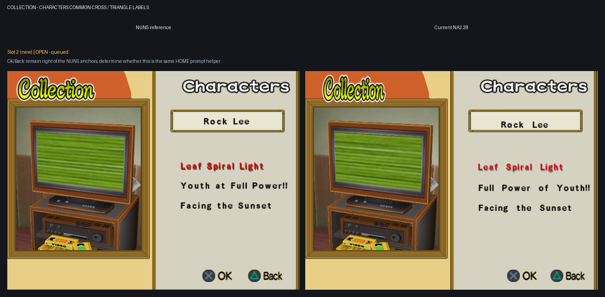

# Remaining UI Translation epic

Current report snapshot: 2026-07-26.

Every grid shows the official NUN5 reference on the left and Current NA2.28 on
the right.

## Remaining subtasks

1. Battle Results screen 2: labels, title, footer, and moving clouds are fixed;
   the red rank text remains vertically misregistered inside the stamp. A
   screen-space Y trial was disproven and reverted; resume at the loaded
   texture/CLUT binding or cached GS packet.
2. Character Items transition: replace the NA2.28 slide with the NUN5/base-NA2
   fade behavior.
3. Cross/Triangle labels, paired slots 1-5: Slot 1 Options is implemented and
   matches the guarded NUN5 runtime proof. Slot 2 Collection root is also
   implemented through its distinct shared position table and matches the
   guarded NUN5 proof. Slot 3 Collection Music is implemented once in its
   shared HOME action helper and matches the guarded NUN5 proof. Slot 4
   Character Select extends its existing shared footer patch with the same
   effective NUN5 OK/Back anchors and matches the guarded runtime proof; Slot 5
   remains. A newer paired slot 2 adds the Collection Characters OK/Back
   footer after the current cases. Correct only the Cross and Triangle labels
   across the preserved screens as one shared subtask.

## Report grids

### Battle results

### Character items

### Cross/Triangle labels

